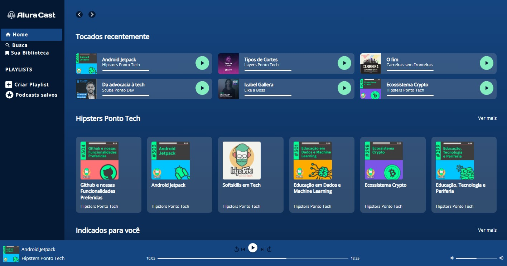

<h1 align="center">ALURA CAST</h1>

Esse projeto foi priorizando GRID, durante o curso CSS: construindo layouts com Grid, da plataforma Alura. 

## Tecnologias

Esse projeto foi desenvolvido com as seguintes tecnologias:
- HTML e CSS
- Git e Github
- Figma

## Link da página do projeto  

<a href="https://rsantosmartins.github.io/AluraCast/">Visite o Projeto Alura Cast</a>